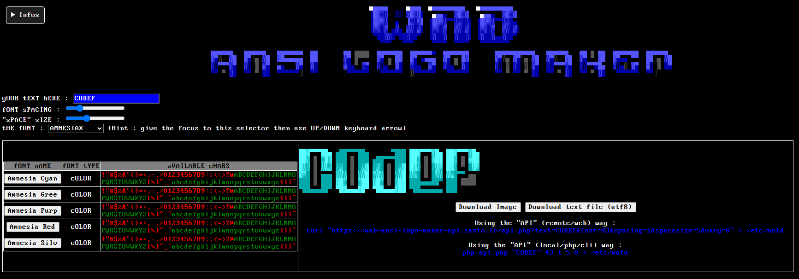
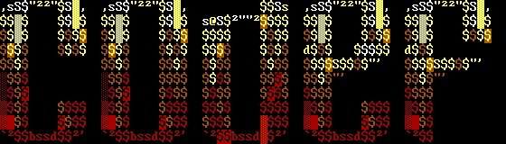

# WAB-Ansi-Logo-Make

A tiny web tool to use TDF (TheDraw font files) to create logo.

WAB-Ansi-Logo-Make is using [CODEF](https://codef.santo.fr)

## Screenshot

## Usage
- Enter you name/nick/handle/text
- Choose a font
- Profit ;)

## Some logo done with it

## Try it Live
[HERE](https://n0namen0.github.io/WAB-Ansi-Logo-Make/)

## License
[MIT](https://choosealicense.com/licenses/mit/)
